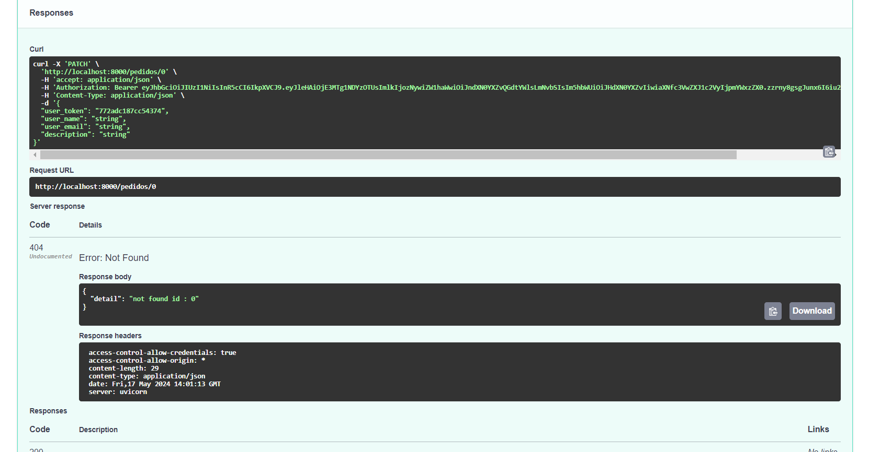

# 2024-M10-P1

## Environment Variables

Para rodar o projeto, é necessário criar um arquivo `.env` na raiz do projeto com as seguintes variáveis de ambiente:

```env
ENV=dev
DB_USER=postgres
DB_PASSWORD=postgres123
DB_HOST=db
DB_PORT=5432

```

## Rodando o projeto

Após clonar o projeto e criar o arquivo `.env`, execute o comando na pasta raiz do projeto:

```bash

docker-compose up

```

O projeto estará disponível em `http://localhost:8000/docs`, onde você poderá acessar a documentação da API, como na imagem abaixo:


## Teste da API

1. Crie um usuário na rota `user/sign-up`
2. Faça login na rota `user/sign-in`
3. Copie o token gerado
4. No swagger, clique no botão `Authorize` e cole o token no campo `Value` e clique em `Authorize`
5. Também guarde o `user_token` para usar nas próximas requisições, ele será necessário para acessar as rotas protegidas
6. Agora você pode testar as rotas disponíveis
7. Na rota `pedidos/novo`, você pode criar um novo pedido e depois visualizá-lo na rota `pedidos/{id}`
8. Você pode também visualizar todos os pedidos na rota `pedidos/`
9. E posteriormente deletar um pedido na rota DELETE `pedidos/{id}` ou atualizá-lo na rota PATCH `pedidos/{id}`


### Novo pedido


### Visualizar pedido


## Vizualizar todos os pedidos


### Atualizar pedido




